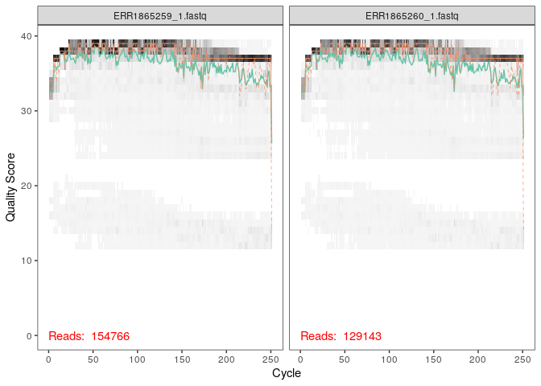
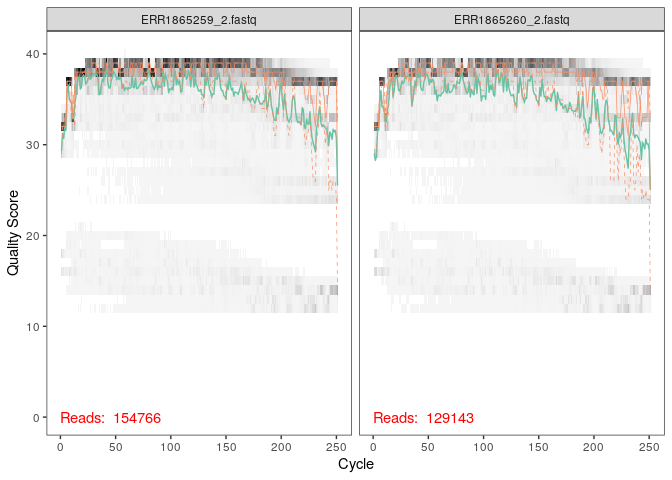
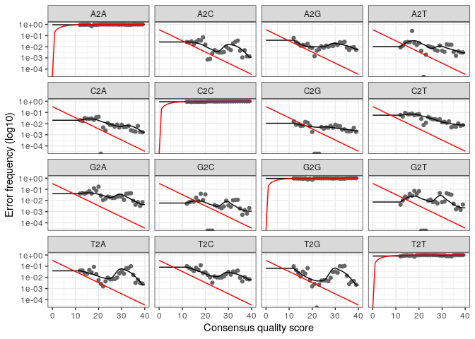

02\_data-analysis
================

  - [appeler la librairie dada2](#appeler-la-librairie-dada2)
  - [Inspect read quality profiles](#inspect-read-quality-profiles)
  - [Filter and trim](#filter-and-trim)
  - [apprentissage des erreurs](#apprentissage-des-erreurs)

# appeler la librairie dada2

``` r
library("dada2")
```

    ## Warning: multiple methods tables found for 'which'

J’ai télécharger les données utilisées dans l’article “Changes in Marine
Prokaryote Composition with Season and Depth Over an Arctic Polar Year”,
publié sur le site Frontiers in Marine Science. Front. Mar. Sci., 13
April 2017 <https://doi.org/10.3389/fmars.2017.00095>

Les données de séquençage à haut débit ont été soumises à l’archive
européenne des nucléotides (ENA) sous le numéro d’accès PRJEB19605.

Les données utilisées sont dans le fichier donnees\_cc3 que j’ai crée et
j’ai mis à l’intérieur toutes les données importées du site ENA.

Etant donné que les data se trouvant sur le site ENA étaient sous forme
de fastq.gz, je les ai décompresser par la commande gunzip \*.gz dans le
terminal, Elle va permettre de chercher tous les files se trouvant sous
la format: .gz et les décomprésser pour pouvoir faire filter and trim
ensuite. J’ai du décompresser les données étant donné que la fonction
filterandtrim(), n’accepte pas le format fastq.gz. La commande suivante
permet de définir une variable path pour qu’elle pointe vers le
répertoire donnees\_cc3 où j’ai mis l’ensemble des données extrait sur
la machine.

``` r
path <- "~/Ecogen_cc3/donnees_cc3" # CHANGE ME to the directory containing the fastq files after unzipping.
list.files(path)
```

les lignes de code suivantes permettent de lire les noms des fichiers
fastq et effectuer quelques manipulations de chaînes pour obtenir des
listes correspondantes des fichiers fastq forward et reverse. On va
créer une variable fnFs et on lui assigne la valeur de résultat de la
fonction sort() qui va classer les résultats de la fonction
list.files(), qui va lister les fichiers se trouvant dans path et ayant
le format "\_1.fastq". Ensuite je fais la même chose pour les reverses.
En suite on va extrairer les sample names avec la fonction strsplit(),
en supposant que les noms de fichiers ont le format:
SAMPLENAME\_XXX.fastq

``` r
# Forward and reverse fastq filenames have format: SAMPLENAME_R1_1.fastq and SAMPLENAME_R2_1.fastq
fnFs <- sort(list.files(path, pattern="_1.fastq", full.names = TRUE))
fnRs <- sort(list.files(path, pattern="_2.fastq", full.names = TRUE))
# Extract sample names, assuming filenames have format: SAMPLENAME_XXX.fastq
sample.names <- sapply(strsplit(basename(fnFs), "_"), `[`, 1)
```

# Inspect read quality profiles

Nous commençons par visualiser les profils de qualité des Forward reads
en utilisant la fonction plotQualityProfile qui va permettre de tracer
un résumé visuel de la distribution des scores de qualité en fonction de
la position de la séquence pour le fichier: fnFs fastq d’entrée.

``` r
library(dada2)
plotQualityProfile(fnFs[1:2])
```

<!-- -->

Les lectures forward sont de bonne qualité.. on va rogner par défaut les
10 derniers nucléotides, pour éviter des erreurs moins bien contrôlées
qui peuvent s’y produire. on va tronquer donc les lectures avant à la
position 240 (en coupant les 10 derniers nucléotides).

on visualise le profil de qualité des reverse reads en utilisant la
fonction plotQualityProfile qui va permettre de tracer un résumé visuel
de la distribution des scores de qualité en fonction de la position de
la séquence pour le fichier: fnRs fastq d’entrée.

``` r
plotQualityProfile(fnRs[1:2])
```

<!-- -->
Comentaire de graphe au dessus: sur ce graphe on remarque que la qualité
est moins bonne que celle du graphe des forwards, on tranque donc les
lectures inversées à la position 240 où la distribution de qualité
baisse.

# Filter and trim

Les lignes de code suivante vont permettre de créer un fichier filtered
dans la subdirectory de path et ensuite mettre le noms des fichiers sous
format \_F\_filt.fastq.gz après filtrage.

``` r
# Place filtered files in filtered/ subdirectory
filtFs <- file.path(path, "filtered", paste0(sample.names, "_F_filt.fastq.gz"))
filtRs <- file.path(path, "filtered", paste0(sample.names, "_R_filt.fastq.gz"))
names(filtFs) <- sample.names
names(filtRs) <- sample.names
```

Ici, on crée une variale out et on lui assigne les valeurs des résultats
de la fonction filterAndTrim(), qui va filtrer et ajuster les fichiers
fnFs, filtFs, fnRs, filtRs de fastq d’entrée (peut être compressé) en
fonction de plusieurs critères: maxN=0, maxEE=c(2,2), truncQ=2,
rm.phix=TRUE,compress=TRUE, multithread=TRUE , et génère des fichiers
fastq (compressés par défaut) contenant les lectures coupées qui ont
passé les filtres. Ensuite on va utiliser la fonction head pour avoir un
apperçu de l’objet out.

``` r
library(dada2)
out <- filterAndTrim(fnFs, filtFs, fnRs, filtRs, truncLen=c(240,240),
              maxN=0, maxEE=c(2,2), truncQ=2, rm.phix=TRUE, multithread=TRUE) 
head(out)
```

    ##                    reads.in reads.out
    ## ERR1865259_1.fastq   154766    140600
    ## ERR1865260_1.fastq   129143    113314
    ## ERR1865261_1.fastq   138164    124364
    ## ERR1865262_1.fastq   148441    100950
    ## ERR1865263_1.fastq   175041    138447
    ## ERR1865264_1.fastq   129785    107663

# apprentissage des erreurs

dada2 calcul un model d’erreurs apartir des données de séquençage.

L’algorithme DADA2 utilise un modèle d’erreur paramétrique ( err) et
chaque jeu de données d’amplicon a un ensemble différent de taux
d’erreur. La learnErrors() méthode apprend ce modèle d’erreur à partir
des données, en alternant l’estimation des taux d’erreur et l’inférence
de la composition de l’échantillon jusqu’à ce qu’ils convergent vers une
solution cohérente conjointement.

``` r
errF <- learnErrors(filtFs, multithread=TRUE)
```

    ## 115014720 total bases in 479228 reads from 4 samples will be used for learning the error rates.

dada2 calcul un model d’erreurs apartir des données de séquençage, on
applique cette méthode sur les reads Reverse de la même manière que pour
forwards.

``` r
library(dada2)
errR <- learnErrors(filtRs, multithread=TRUE)
```

    ## 115014720 total bases in 479228 reads from 4 samples will be used for learning the error rates.

La fonction plotErrors() va tracer la fréquence observée de chaque
transition (par exemple A-\> C) en fonction du score de qualité associé.
Elle trace également les taux d’erreur estimés finaux (s’ils existent).
l’argument nominalQ=TRUE va permettre de tracer les taux d’erreur
attendus (ligne rouge) si les scores de qualité correspondent exactement
à leur définition nominale: Q = -10 log10 (p\_err).

``` r
library(dada2)
plotErrors(errF, nominalQ=TRUE)
```

    ## Warning: Transformation introduced infinite values in continuous y-axis
    
    ## Warning: Transformation introduced infinite values in continuous y-axis

<!-- -->

Intérprétation de graphe précédent: graphe 1: la probabilité que A est A
doit être max ainsi de suite… les taux d’erreur pour chaque transition
sont indiquées sur les graphes (graphe 2: A–\>C etc) c2: probabilité
d’erreus de séq pour qu’un A soit un C. Ici, les taux d’erreur estimés
(ligne noire) correspondent bien aux taux observés (points), et les taux
d’erreur diminuent avec une qualité accrue comme prévu. Tout semble
raisonnable et nous procédons en toute confiance.

``` r
save.image(file="02_data-analysis")
```
